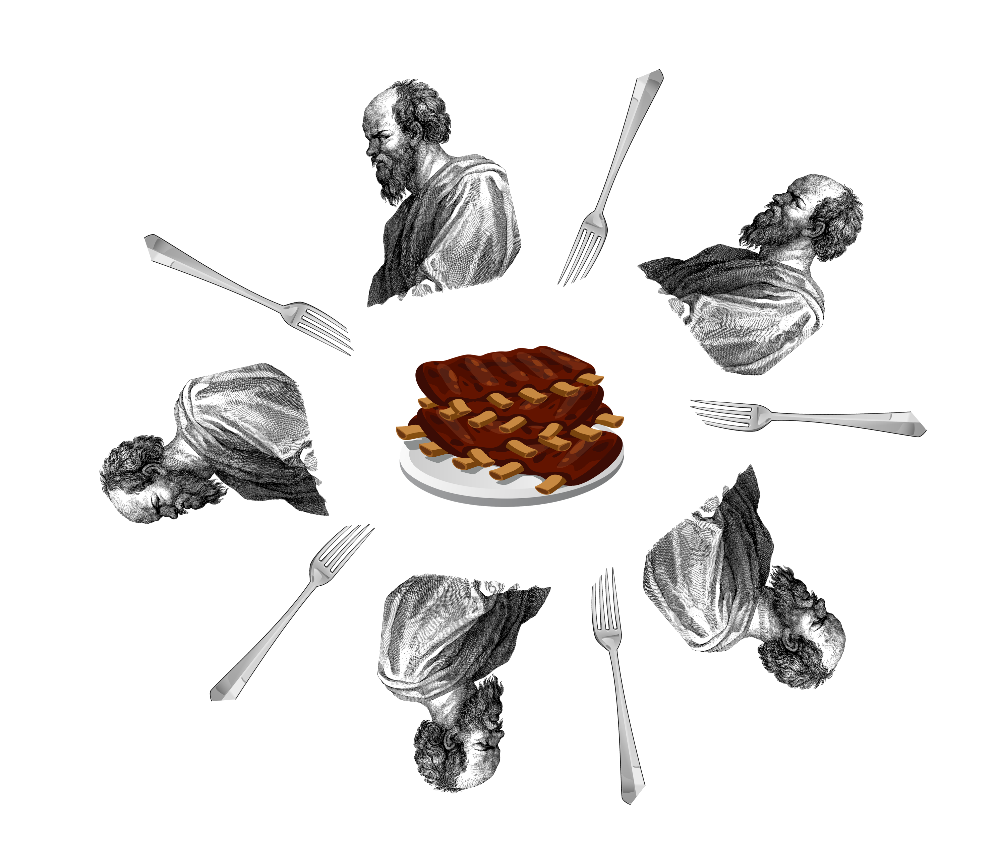
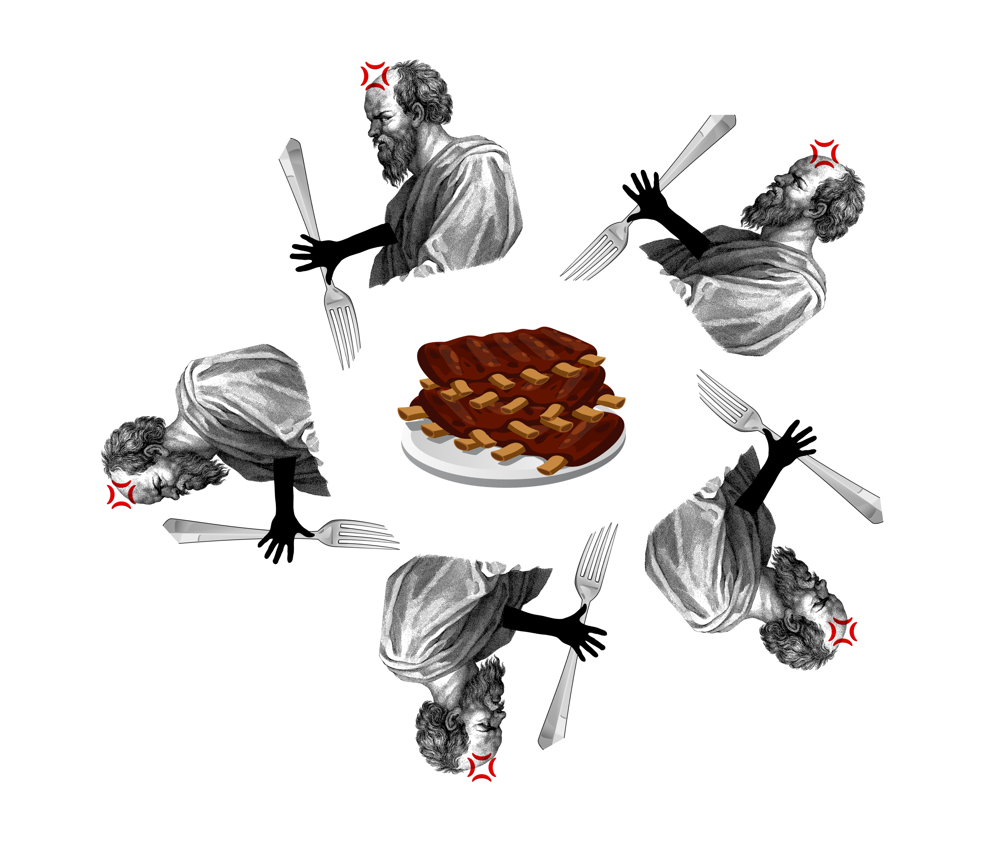
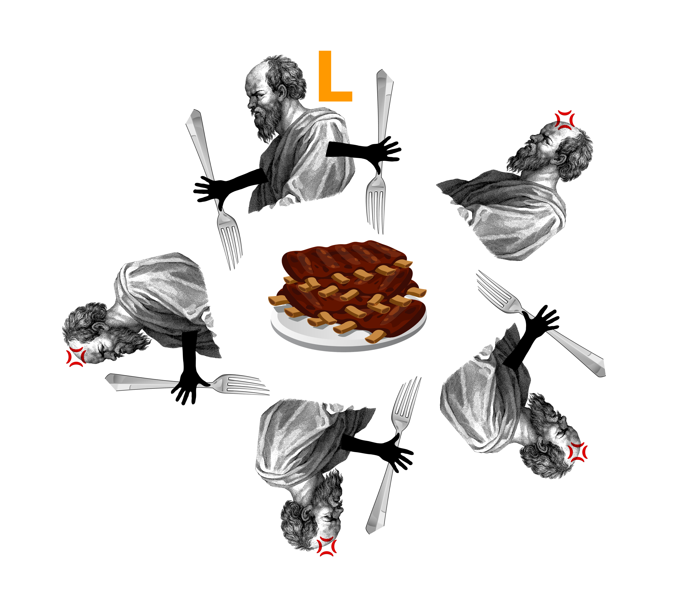

# PPDS assignment 3 - Dining philosophers
At this assignment we deal _dining philosophers_ problem using right/left-handed philosophers.
## Dining philosophers problem
Dining philosophers problem is synchronization problem based on the analogy of K dining philosophers having a meal at a round table. They have only K forks between them and if someone wants to eat, they have to pick up both the right and left fork, but one fork can pick up only one philosopher.
Philosopher can eat or think and if there is no available fork for eating, he is thinking again.[^1]



We want to make sure that philosophers don't starve to death and that we don't get a deadlock (each philosopher takes one fork on the same side)



## Left/right-handed philosophers
To avoid deadlock we use implementation, where one philosopher picks up fork with another hand first.



If left-handed has no fork, philosopher on the right can pick up both forks (or next philosopher is already eating etc...).
When left-handed philosopher takes left fork, there are 2 possible scenarios:
- next fork (right) is free and philosopher can take it and eat,
- next fork isn't free because it has philosopher on the right. This means, next philosopher is eating, and he will release this fork later. 

There is always situation in all scenarios, where one can eat and then release both forks, so there is no possible deadlock.

## Implementation
In this program there are 2 global variables - `NUM_PHILOSOPHERS` to keep number of philosophers and `NUM_RUNS` to keep number of think-eat cycles.

### Shared object
Shared object is object shared by all threads with shared resources and has attribute `forks`, which is array containing Mutex for every fork (total `NUM_PHILOSOPHERS` forks).

### Function _philosopher_ 
Function for philosopher cycle takes as an argument `i` - philosopher's id and `shared` - Shared object.
This function repeats `NUM_RUNS` think-eat process. At first the function _think_, which simulates thinking, is called. Then we check philosopher's id - when it is first philosopher (id is 0), this philosopher is marked as _left-handed_ and there is called function _left_handed_pick_, where is first locked fork on the right and then fork on the left. Otherwise the philosopher takes the forks in reverse order (_right_handed_pick_ function is called).

After the philosopher picks up both forks, function _eat_ is called, to simulate eating process for philosopher. Then both forks are unlocked.

## Comparison

## How to run script
1. Clone repository
   ```sh
   git clone repository_url
   ```
2. Install package `fei.ppds` using pip:
   ```sh
   py -3 -m pip install --upgrade fei.ppds
   ```
   or for Linux:
   ```sh
   pip3 install --upgrade fei.ppds
   ```
3. Run script using Python interpreter (ver. 3.10)

---
Martin Fridrik, PPDS FEI STUBA
2023
---

[^1]: https://www.geeksforgeeks.org/sleeping-barber-problem-in-process-synchronization/