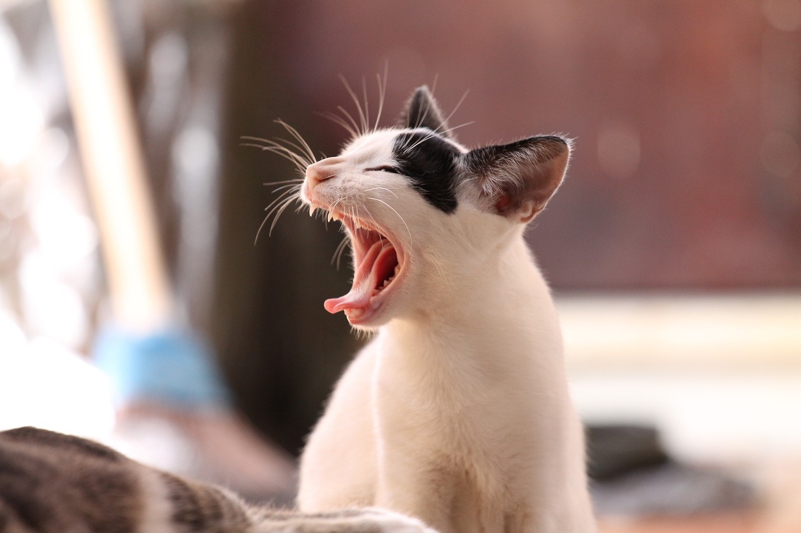
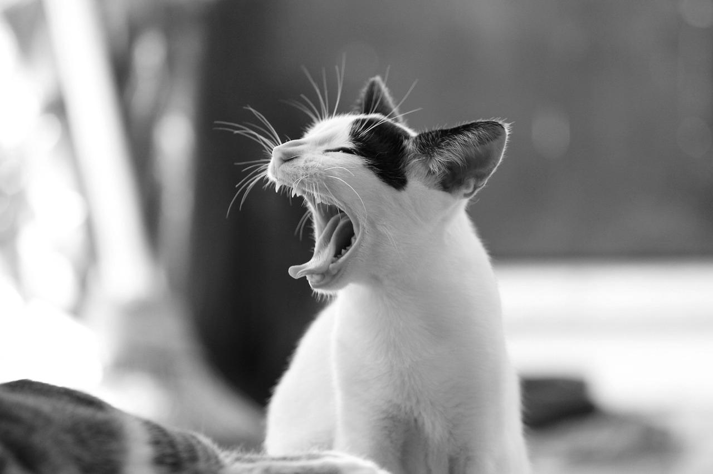
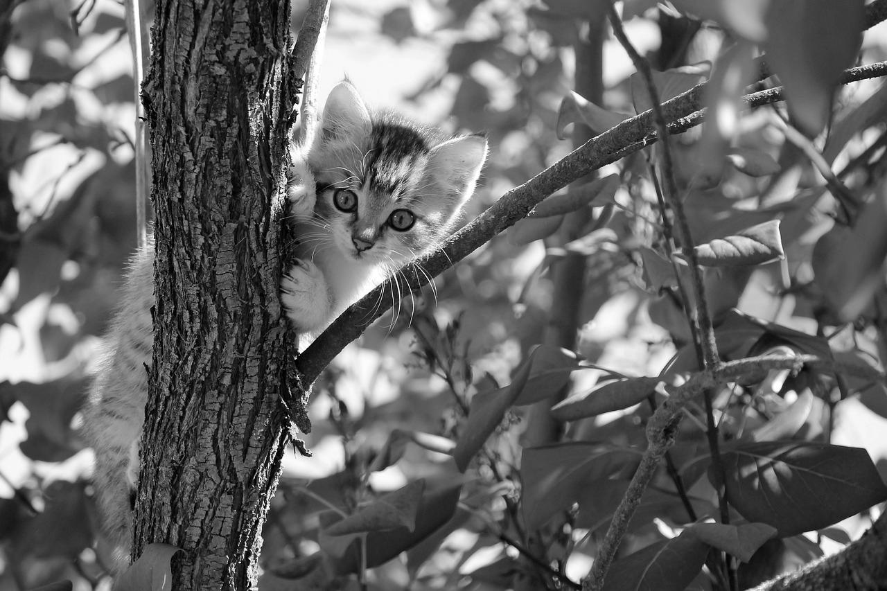

# PPDS assignment 5 - Cuda
In this assignment, we deal with transforming images to grayscale
using GPU (CUDA) and CPU and comparing the two methods.

## Grayscale transforming
In our code there are 2 functions to transform image into grayscale:

`grayscale_cpu` - function sequentially traverses a 2D array of RGB points and applies a grayscale transformation to each point.

`grayscale_cuda` - function prepares arguments for CUDA GPU kernel - function `grayscale_kernel` where transformation for points runs parallel on GPU.
### Transforming formula
To transform image from RGB into grayscale we used following formula:

`0.2989 * R + 0.5870 * G + 0.1140 * B` [^1]

This outputs value in range 0 (white) - 255 (black), which is used for creating grey pixel with this value for all R, G and B colors in result image using `cmap='gray'` while saving picture. 

## Testing dataset
We tested functions with dataset of 30 images of different sizes. Images are saved in `imgs` directory.

Grayscaled images are saved in `gray_imgs` directory and `cpu` or `gpu` subdirectories.

### Grayscaled images examples

<br />


<br />


<br />


### Testing results

| Image   | Size      | GPU time(s) | CPU time(s) |
|:--------|:----------|------------:|------------:|
| 01.jpg  | 340x509   |      0.4476 |      1.1461 |
| 02.jpg  | 340x557   |       0.002 |      1.1879 |
| 03.jpg  | 340x325   |      0.0031 |      0.6224 |
| 04.jpg  | 340x498   |       0.002 |      0.9811 |
| 05.jpg  | 340x511   |       0.003 |      0.9568 |
| 06.jpg  | 340x510   |       0.004 |      0.9548 |
| 07.jpg  | 340x510   |       0.003 |      0.9713 |
| 08.jpg  | 867x1280  |      0.0202 |      6.1148 |
| 09.jpg  | 960x1280  |      0.0252 |      6.7485 |
| 10.jpg  | 853x1280  |      0.0243 |      6.0377 |
| 11.jpg  | 853x1280  |      0.0263 |      5.9867 |
| 12.jpg  | 851x1280  |      0.0232 |      6.0056 |
| 13.jpg  | 1073x1280 |       0.028 |      7.6273 |
| 14.jpg  | 850x1280  |       0.024 |      6.0369 |
| 15.jpg  | 853x1280  |      0.0235 |      6.0086 |
| 16.jpg  | 898x1920  |      0.0345 |      9.5245 |
| 17.jpg  | 1272x1920 |      0.0506 |     13.4742 |
| 18.jpg  | 1280x1920 |      0.0477 |     13.4554 |
| 19.jpg  | 1280x1920 |      0.0494 |     13.6898 |
| 20.jpg  | 1536x1920 |      0.0571 |     16.1796 |
| 21.jpg  | 1282x1920 |      0.0495 |     13.7215 |
| 22.jpg  | 1427x1920 |      0.0562 |     15.1497 |
| 23.jpg  | 1280x1920 |       0.048 |     13.5272 |
| 24.jpg  | 1277x1920 |      0.0483 |      13.488 |
| 25.jpg  | 1280x1920 |      0.0497 |     13.5352 |
| 26.jpg  | 2294x3441 |      0.1399 |     43.7159 |
| 27.jpg  | 4000x6000 |      0.3063 |     138.257 |
| 28.jpg  | 6000x4000 |      0.3712 |     133.326 |
| 29.jpg  | 2002x3000 |       1.229 |     33.1244 |
| 30.jpg  | 4243x6362 |      0.2832 |     149.833 |

- avg time for small images (02-07) (without outlier 01)
  - GPU: 0.0029s
  - CPU: 0.9457s


- avg time for bigger images (08-16)
  - GPU: 0.0255s
  - CPU: 6.6767s


- avg time for big images (17-25)
  - GPU: 0.0507s
  - CPU: 14.0245s


- avg time for very big images (26-30)
  - GPU: 0.4659s
  - CPU: 99.6512s


- total avg time (01-30)
  - GPU: 0.116s
  - CPU: 23.0463s


We can see that for smaller images there is little difference between the CPU and GPU however the larger the images we have, the difference increases significantly.

**Tested with CUDA device**: _GeForce GTX 1650 Ti_

**Dataset images source**: pixabay.com

## How to run script
1. Clone repository
   ```sh
   git clone repository_url
   ```
2. Install required packages (matplotlib, numba, numpy)
3. Set up CUDA for GPU or use simulation:
   ```sh
   set NUMBA_ENABLE_CUDASIM=1
   ```
4. Run script using Python interpreter (ver. 3.10)

---
Martin Fridrik, PPDS FEI STUBA
2023
---

[^1]: https://stackoverflow.com/questions/12201577/how-can-i-convert-an-rgb-image-into-grayscale-in-python