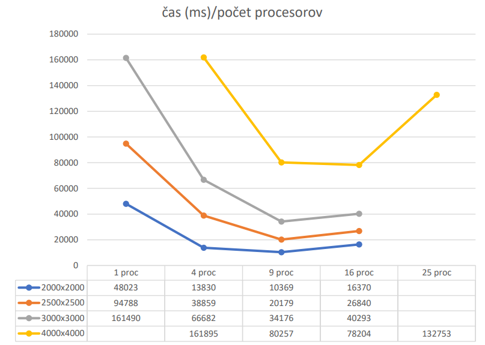

# [MPI] Parallel Floyd-Warshall using 2D-block mapping

## Program input
- Weighted directed graph
- The file is read from the value in #define INPUT
- The program expects the number of vertices on the first line
- The program expects input on subsequent lines in the format x y z, where x and y are edges from the city 
with index x to the city with index y, evaluated from
## The output of the program
- The program produces a file with lines in the format x y z, where x and y is the edge from the city with index x
to the city with index y and the minimum path between them z, for all distinct cities that are 
linked
## Algorithm
- Parallel Floyd-Warshall using 2D block mapping
- The number of processors `p` must be a square, otherwise only the nearest square will be used for the computation 
smaller than `p`
- Each processor processes one block of the original total input (n x n),
with size `(n/sqrt(p)) x (n/sqrt(p))`
- At the beginning of each cycle, the processes in the columns or rows send their segments
rows and columns respectively

## Computation time

